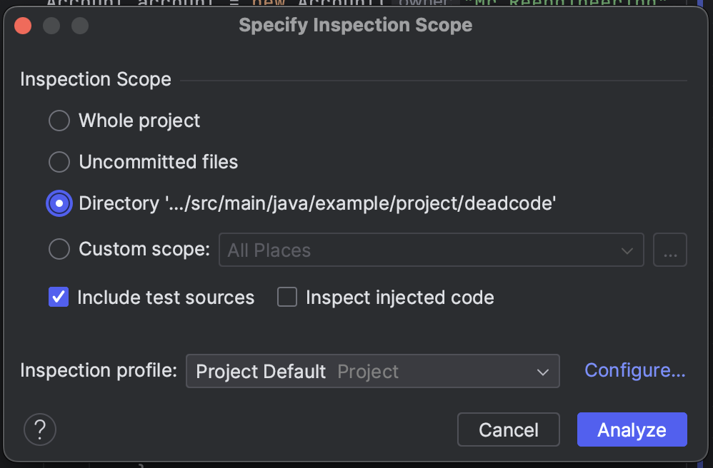
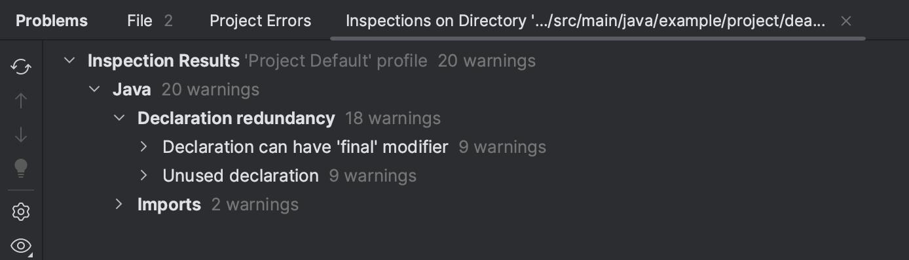

# Unnecessary Code

This repository includes lab materials to support the Spring Semester of the COM3523/6523 module "Software Reengineering" at the University of Sheffield.

In this week, we explore "unnecessary code".

## Important Notes

We don't have a list of tests that check your progress in this week, mainly because "removing unnecessary code" is not something that can be easily tested.

However, we do have a list of tasks you need to complete. This is to give you a better idea on how unnecessary code looks like in different granularities (e.g., statements, methods, classes, etc.). and how to identify/remove them.

## Part 0: Setup

This part is to set up your own repository and understand the code in the repository.

### Step 1: Clone your repository
First, clone this repository to your local machine
(e.g., the user drive in the University computer; `u:/Teaching/COM3523/2022-23` in my case).
Open `Git Bash` and enter the following commands:

```bash
cd u:/Teaching/COM3523/2022-23
git clone [YOUR_REPOSITORY_ADDRESS]
```

### Step 2: Take a look at the code
Now, take a look at the code you just cloned.
If you want, open the project in IntelliJ and browse the files in it.
For those who wants to install IntelliJ 2022 on your shared drive (/U:),
please refer to [this guideline](/resources/install-intellij-user-drive.md).

## Part 1: Unnecessary Code

This part is about dead code detection using IntelliJ.

### (Task1) Dead code detection using IntelliJ

Right-click the folder "deadcode" in the project view, and select "Analyze | Inspect Code...". You should see the following window:



Click "Analyze" and wait for the inspection to finish. You should see the following window:



Take a look at the results, one by one. See if they are really dead code. 

In the "deadcode" folder, you should be able to see:
- dead code in the granularity of statements (variables)
- dead code in the granularity of methods
- dead code in the granularity of imports

### (Task2) Identify feature-specific code using Software Reconnaissance

In [Client.java](src/main/java/example/project/deadcode/Client.java), we have two client features implemented as `feature1()` and `feature2()`.
Let's assume that the second feature is no longer used by any users for a long time, i.e., the code related to the second feature is unused code.

Although it looks clear what classes/methods are only relevant to `feature2()` but not `feature1()` in this example due to the short methods, it might be difficult to identify such code in a large-scale project.

So, let's use dynamic analysis to identify such unused classes/methods. Specifically, please use software reconnaissance to identify the unused classes/methods in the following steps:

1. Make a wrapper main method that calls `feature1()` in [Client.java](src/main/java/example/project/deadcode/Client.java).
2. Collect an execution trace of the wrapper main method using software reconnaissance (feel free to use the reengineering toolkit provided in Week 4 Lab or Assignment 1).
3. Repeat steps 1-2 for `feature2()`.
4. Compare the execution traces of the two features and identify the classes/methods only required for `feature2()`; they are the unused classes/methods we can remove without affecting the rest of the system.

### (Task3) Understand the unused code in the project using call graphs

In the previous task, you identified the unused code that can be removed without affecting the rest of the system.
To make sure if this is correct, let's use static analysis to understand how the unused code is used in the project.
Feel free to use the reengineering toolkit provided in Week 3 Lab or Assignment 1.

How does the call graph look like? Is the unused code can be safely removed? Can you discuss your answer based on the call graph?